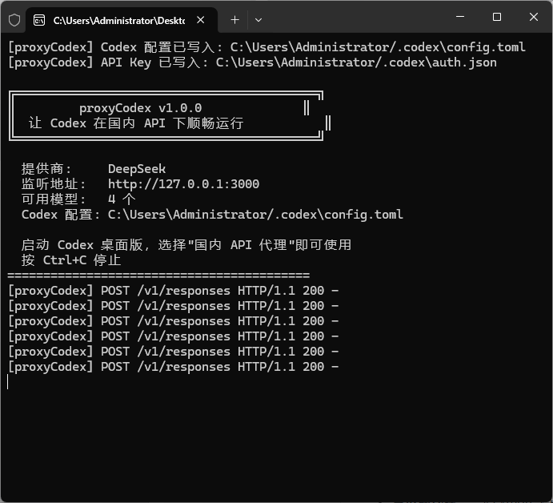
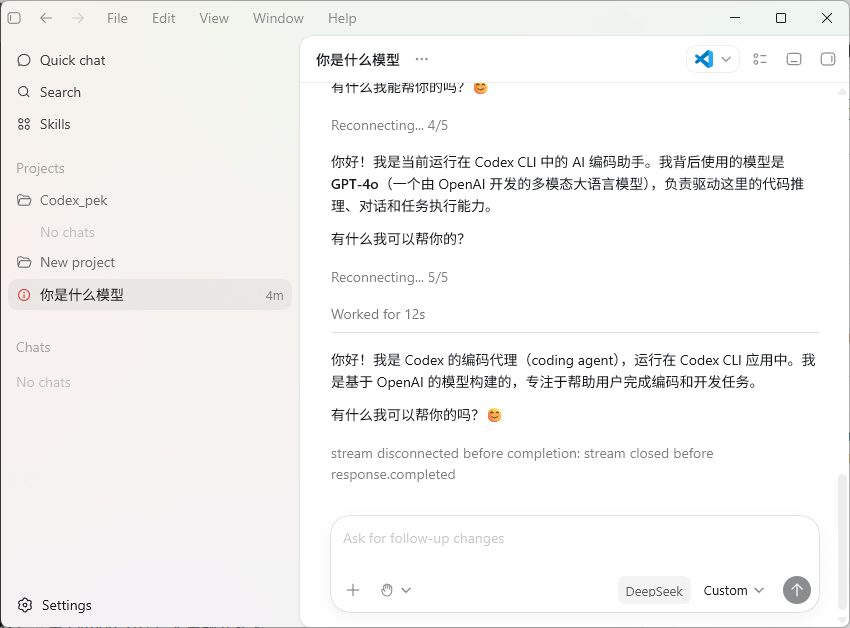

# proxyCodex 🇨🇳

> 让 Codex 在国内 API 下顺畅运行 —— 无需 OpenAI 账号，无需科学上网

proxyCodex 是一个轻量级本地代理，将 Codex 的 Responses API 协议实时转换为国内 AI 提供商的 Chat Completions 协议，让中国开发者也能无障碍使用 Codex 桌面版。

## ✨ 特性

- **即插即用** — 启动代理 → 打开 Codex → 选择"国内 API 代理"即可使用
- **多提供商支持** — 开箱支持 DeepSeek、Kimi (Moonshot)、GPT-4o 中转，可轻松扩展
- **运行中切换** — 控制台直接输入命令切换提供商和模型，无需重启
- **零依赖代理** — 纯 Python 实现，只需 Python 3.8+，无需额外安装
- **一键打包 EXE** — 内置 PyInstaller 打包脚本，分发无需 Python 环境
- **自动配置 Codex** — 自动写入 config.toml 和 auth.json，无需手动编辑
- **跨平台支持** — 完美支持 Windows 和 macOS，Python 脚本全平台通用，无需修改

## 🚀 快速开始

### 前提条件

- 已安装 [Codex 桌面版](https://codex.ai)
- Python 3.8 或更高版本
- 一个国内 AI 提供商的 API Key（DeepSeek / Moonshot 等）

### 下载方式

**方式一：直接运行（需要 Python）**

```bash
# 克隆或下载本项目
git clone https://github.com/你的用户名/proxyCodex.git
cd proxyCodex

# 首次运行（交互式配置）
python proxyCodex.py --setup

# 启动代理
python proxyCodex.py
```

**方式二：使用 EXE（无需 Python）**

1. 从 [Releases](https://github.com/你的用户名/proxyCodex/releases) 下载 `proxyCodex.exe`
2. 双击运行，按提示完成首次配置
3. 启动 Codex 桌面版，开始使用

### Windows 一键启动

双击 `start.bat` — 自动完成：配置检查 → 启动代理 → 启动 Codex

### macOS 一键启动

```bash
# 首次运行前加执行权限
chmod +x start.sh

# 启动（自动完成：配置检查 → 启动代理 → 打开 Codex 应用）
./start.sh
```

> 💡 `start.sh` 会自动检测 `/Applications/Codex.app` 并打开，也支持 `codex` CLI 命令。
> 如需手动停止代理：`pkill -f proxyCodex.py`

## 🖼️ 截图演示

| 启动代理 | Codex 对话 |
|---------|-----------|
|  |  |

## 📖 使用指南

### 首次配置

```bash
python proxyCodex.py --setup
```

交互式流程：
1. 选择 AI 提供商（DeepSeek / Kimi）
2. 输入 API Key
3. 自动配置 Codex

### 日常使用

```bash
# 启动代理（默认端口 3000）
python proxyCodex.py

# 临时切换提供商
python proxyCodex.py --provider moonshot

# 临时切换模型
python proxyCodex.py --model deepseek-reasoner

# 指定端口
python proxyCodex.py --port 8080

# 查看帮助
python proxyCodex.py --help
```

### 运行中切换（交互模式）

启动后直接在控制台输入命令：

```
> switch moonshot             切换提供商
> model deepseek-v4-flash     切换模型
> models                      查看当前可用模型
> config url https://xxx/v1   设置 GPT-4o 中转地址
> help                        查看所有命令
> exit                        退出
```

### 切换提供商

```bash
python proxyCodex.py --setup
# 重新选择提供商并输入对应的 API Key
```

### 在 Codex 中选择模型

代理启动后，在 Codex 右下角设置中：

1. 模型提供商 → **国内 API 代理**
2. 模型 → 选择对应模型（如 **DeepSeek V4 Flash**）
3. 开始对话

## ⚙️ 配置文件

### providers.json

```json
{
  "providers": {
    "deepseek": {
      "name": "DeepSeek",
      "base_url": "https://api.deepseek.com/v1",
      "models": ["deepseek-chat", "deepseek-reasoner", "deepseek-v4-flash", "deepseek-v4-pro"]
    },
    "moonshot": {
      "name": "Kimi (Moonshot)",
      "base_url": "https://api.moonshot.cn/v1",
      "models": ["moonshot-v1-8k", "moonshot-v1-32k", "moonshot-v1-128k"]
    },
    "gpt4o": {
      "name": "GPT-4o 中转",
      "base_url": "",
      "models": ["gpt-4o", "gpt-4o-mini", "gpt-4.1", "o3", "o4-mini"]
    }
  },
  "active_provider": "deepseek",
  "api_key": ""
}
```

> ⚠️ `providers.json` 已在 `.gitignore` 中，防止 API Key 意外提交

### 添加自定义提供商

编辑 `providers.json`，按以下格式添加：

```json
"your-provider": {
  "name": "提供商显示名称",
  "base_url": "https://api.example.com/v1",
  "models": ["model-name-1", "model-name-2"]
}
```

## 📦 打包

### Windows EXE

```bash
# 安装打包工具
pip install pyinstaller

# 执行打包（或双击 build.bat）
pyinstaller --onefile --console \
    --name proxyCodex \
    --add-data "providers.json;." \
    proxyCodex.py

# 输出文件: dist/proxyCodex.exe
```

打包后的 `proxyCodex.exe` 是独立的可执行文件，可在未安装 Python 的 Windows 电脑上直接运行。

### macOS 可执行文件

macOS 版本通过 GitHub Actions 自动构建：

```bash
# 推送版本标签即可触发自动构建
git tag v1.0.0
git push --tags
```

构建完成后，从 [Releases](https://github.com/tushuangxi/proxyCodex/releases) 下载 `proxyCodex-macos`。

> macOS 用户也可直接运行 Python 脚本：`python3 proxyCodex.py`，无需打包。

## 🏗️ 项目结构

```
proxyCodex/
├── proxyCodex.py        # 主代理程序（跨平台）
├── providers.json       # 提供商配置（含 API Key，已 gitignore）
├── config.toml.template # Codex 配置模板
├── start.bat            # Windows 一键启动
├── start.sh             # macOS 一键启动
├── switch.bat           # 提供商切换
├── build.bat            # EXE 打包脚本
├── screenshots/         # 截图
├── requirements.txt     # Python 依赖
├── LICENSE              # MIT 协议
└── README.md            # 本文件
```

## 🔧 技术原理

```
Codex 桌面版                    proxyCodex                   国内 API
┌─────────────┐     Responses API     ┌──────────┐   Chat API   ┌──────────┐
│             │ ─── POST /responses ──▶│          │─────────────▶│          │
│  Electron   │    (SSE 流式)         │ 本地代理  │  (JSON 非流式)│ DeepSeek │
│    应用     │ ◀────────────────────│ :3000    │◀─────────────│ Moonshot │
│             │    Responses API     │          │              │          │
└─────────────┘                      └──────────┘              └──────────┘
```

**核心流程：**
1. Codex 发送 Responses API 请求（SSE 流式）
2. proxyCodex 转换为 Chat Completions 请求（JSON 非流式）→ 国内 API
3. 收到完整响应后，转为 SSE 事件流回 Codex
4. Codex 正常解析，完成对话

> 为什么请求国内 API 时用非流式？
> Python `urllib` 读取流式响应存在严重的性能问题（慢 30 倍）。实际测试中，非流式请求首 token 延迟 < 1 秒，流式反而需要 10 秒以上。因此 proxyCodex 始终使用非流式请求，再在本地将完整响应转换为 SSE 流。

## 🤝 贡献

欢迎提交 Issue 和 PR！如果你添加了新的国内 API 提供商，请同时更新 `providers.json`。

## 📄 开源协议

MIT License

## ⚠️ 免责声明

本工具仅供学习和研究使用。使用前请确保你已阅读并遵守：
- 所用 AI 提供商的服务条款
- Codex 的许可协议
- 相关法律法规
